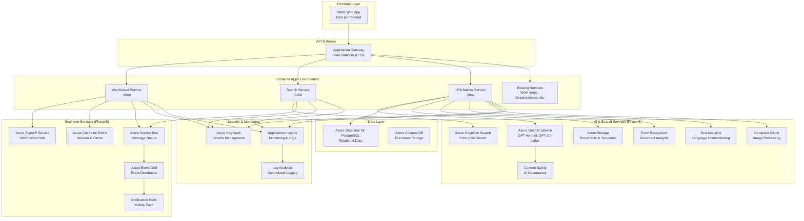

# HTMA Phase 5-6 Azure Architecture with Notification Service Guide

## Overview

This document describes the Azure infrastructure for **Phase 5 (Real-time Foundation)** and **Phase 6 (HTA Builder & AI Services)** of the HTMA platform. The architecture leverages native Azure services for optimal performance, cost efficiency, and scalability.

## 🏗️ Architecture Overview

### Phase 5: Real-time Foundation
- **Azure SignalR Service** - WebSocket connections and real-time messaging
- **Azure Cache for Redis** - Session storage and real-time data caching
- **Azure Service Bus** - Message queuing and event-driven architecture
- **Azure Event Grid** - System-wide event distribution
- **Azure Notification Hubs** - Mobile push notifications

### Phase 6: AI & Search Services
- **Azure OpenAI Service** - AI-powered HTA generation and refinement
- **Azure Cognitive Search** - Enterprise search with semantic capabilities
- **Azure Cognitive Services** - Text analytics, form recognition, and vision
- **Azure Storage Account** - Document and template storage
- **Content Safety** - AI governance and safety monitoring

### Notification Service (Google Workspace Integration)
- **Azure Communication Services** - Backup email delivery mechanism
- **Azure Event Grid** - Event-driven notification triggers
- **Azure Storage Account** - Email templates and attachment storage
- **Google Workspace SMTP** - Primary email delivery via OAuth2
- **Professional Email Templates** - Workflow notifications and alerts

### Container Apps Platform
- **Azure Container Apps** - Serverless container hosting for all services
- **Azure Container Registry** - Private container image registry
- **Managed Identity** - Secure service-to-service authentication
- **Application Insights** - Comprehensive monitoring and diagnostics

## 📊 Service Architecture Diagram



## 🚀 Deployment Architecture

### Resource Groups Structure
```
htma-dev-rg/
├── Real-time Services
│   ├── htma-dev-signalr (Azure SignalR Service)
│   ├── htma-dev-redis (Azure Cache for Redis)
│   ├── htma-dev-servicebus (Azure Service Bus)
│   ├── htma-dev-events (Azure Event Grid Topic)
│   └── htma-dev-notifications (Notification Hubs)
│
├── AI & Search Services
│   ├── htma-dev-openai (Azure OpenAI Service)
│   ├── htma-dev-search (Azure Cognitive Search)
│   ├── htmadevstorage (Azure Storage Account)
│   ├── htma-dev-formrecognizer (Form Recognizer)
│   ├── htma-dev-textanalytics (Text Analytics)
│   ├── htma-dev-vision (Computer Vision)
│   └── htma-dev-contentsafety (Content Safety)
│
├── Container Platform
│   ├── htma-dev-env (Container Apps Environment)
│   ├── htma-dev-env-websocket (WebSocket Service)
│   ├── htma-dev-env-search (Search Service)
│   ├── htma-dev-env-hta-builder (HTA Builder Service)
│   └── htmadevregistry (Container Registry)
│
└── Shared Infrastructure
    ├── htma-dev-kv (Key Vault)
    ├── htma-dev-ai (Application Insights)
    ├── htma-dev-law (Log Analytics Workspace)
    └── htma-dev-vnet (Virtual Network)
```

## 🔧 Service Configuration

### WebSocket Service (Phase 5)
```yaml
Container App: htma-dev-env-websocket
Port: 3008
Replicas: 1-10 (auto-scaling)
Resources: 0.5-1.0 CPU, 1-2Gi Memory
Health Check: /health

Environment Variables:
- SIGNALR_CONNECTION_STRING: Azure SignalR connection
- REDIS_CONNECTION_STRING: Redis cache connection
- SERVICEBUS_CONNECTION_STRING: Service Bus connection
- JWT_SECRET: Authentication secret
- NODE_ENV: dev/staging/prod
```

### Search Service (Phase 6)
```yaml
Container App: htma-dev-env-search
Port: 3006
Replicas: 1-8 (auto-scaling)
Resources: 0.5-1.0 CPU, 1-2Gi Memory
Health Check: /health

Environment Variables:
- SEARCH_SERVICE_ENDPOINT: Cognitive Search endpoint
- SEARCH_SERVICE_ADMIN_KEY: Search admin key
- SERVICEBUS_CONNECTION_STRING: Service Bus connection
- INDEX_PREFIX: htma-dev
- JWT_SECRET: Authentication secret
```

### HTA Builder Service (Phase 6)
```yaml
Container App: htma-dev-env-hta-builder
Port: 3007
Replicas: 1-6 (auto-scaling)
Resources: 1.0-2.0 CPU, 2-4Gi Memory
Health Check: /health

Environment Variables:
- OPENAI_ENDPOINT: Azure OpenAI endpoint
- OPENAI_API_KEY: OpenAI access key
- DATABASE_URL: PostgreSQL connection string
- PRIMARY_AI_MODEL: gpt-4o-mini
- FALLBACK_AI_MODEL: gpt-35-turbo
- JWT_SECRET: Authentication secret
```

## 💰 Cost Optimization

### Phase 5 Services (Real-time)
- **SignalR Service**: Free tier for dev, Standard for prod (~$50/month)
- **Redis Cache**: Basic for dev, Standard for prod (~$15-100/month)
- **Service Bus**: Basic tier (~$10/month)
- **Event Grid**: Pay-per-event (~$1-5/month)
- **Notification Hubs**: Free tier for dev (~$1/month)

### Phase 6 Services (AI & Search)
- **Azure OpenAI**: Pay-per-token, optimized with GPT-4o-mini (~$50-200/month)
- **Cognitive Search**: Basic for dev, Standard for prod (~$250/month)
- **Storage Account**: Hot tier, optimized access (~$10-50/month)
- **Cognitive Services**: F0/S0 tiers (~$0-100/month)

### Container Platform
- **Container Apps**: Consumption-based, ~$0.000024/vCPU-second (~$50-200/month)
- **Container Registry**: Basic tier (~$5/month)

**Total Estimated Monthly Cost**: $400-800 (dev), $1,200-2,500 (production)

## 🔐 Security Configuration

### Authentication & Authorization
- **Managed Identity**: Service-to-service authentication
- **Key Vault Integration**: Secure secret management
- **Azure AD Integration**: User authentication
- **Role-Based Access Control**: Fine-grained permissions

### Network Security
- **Private Endpoints**: Production environment isolation
- **Virtual Network Integration**: Secure service communication
- **NSG Rules**: Network traffic control
- **SSL/TLS**: End-to-end encryption

### Data Protection
- **Encryption at Rest**: All data encrypted
- **Encryption in Transit**: HTTPS/TLS for all communications
- **Secret Management**: Key Vault for all credentials
- **Audit Logging**: Comprehensive activity monitoring

## 📈 Monitoring & Observability

### Application Insights Integration
```javascript
// Service telemetry configuration
{
  "role": "websocket-service",
  "customDimensions": {
    "environment": "dev",
    "version": "1.0.0",
    "phase": "5"
  },
  "metrics": [
    "connection_count",
    "message_throughput",
    "error_rate",
    "response_time"
  ]
}
```

### Key Metrics Tracked
- **WebSocket Service**: Connection count, message throughput, latency
- **Search Service**: Query performance, index size, search latency
- **HTA Builder**: AI token usage, generation time, success rate
- **Infrastructure**: CPU/Memory usage, scaling events, cost

### Alerting Rules
- OpenAI API rate limit approaching (>80% of quota)
- Service health check failures (>3 consecutive failures)
- High error rates (>5% in 5-minute window)
- Resource utilization (>85% CPU/Memory for 10 minutes)
- Cost anomalies (>120% of expected monthly spend)

## 🚀 Deployment Process

### Prerequisites
```bash
# Required tools
az --version                    # Azure CLI 2.50+
docker --version               # Docker 24.0+
export OPENAI_API_KEY="sk-..."  # OpenAI API key

# Required permissions
az role assignment list --assignee $(az account show --query user.name -o tsv)
# Need: Contributor role on subscription or resource group
```

### Quick Deployment
```bash
# Clone repository
git clone https://github.com/your-org/HT-Management.git
cd HT-Management

# Set environment variables
export ENVIRONMENT=dev
export OPENAI_API_KEY="your-openai-key"

# Deploy infrastructure
cd azure/scripts
./deploy-phase5-6.sh

# Verify deployment
source ../phase5-6-dev.env
curl -f $WEBSOCKET_SERVICE_URL/health
curl -f $SEARCH_SERVICE_URL/health
curl -f $HTA_BUILDER_SERVICE_URL/health
```

### Manual Deployment Steps
```bash
# 1. Create resource group
az group create --name htma-dev-rg --location eastus2

# 2. Deploy infrastructure
az deployment group create \
  --resource-group htma-dev-rg \
  --template-file azure/bicep/main.bicep \
  --parameters @azure/parameters-phase5-6.dev.json

# 3. Build and push containers
az acr build --registry htmadevregistry \
  --image htma/websocket-service:latest \
  services/websocket-service/

# 4. Update container apps with new images
az containerapp update \
  --name htma-dev-env-websocket \
  --resource-group htma-dev-rg \
  --image htmadevregistry.azurecr.io/htma/websocket-service:latest
```

## 🔄 CI/CD Integration

### GitHub Actions Workflow
```yaml
name: Deploy Phase 5-6 Services

on:
  push:
    branches: [main]
    paths: 
      - 'services/websocket-service/**'
      - 'services/search-service/**'
      - 'services/hta-builder-service/**'
      - 'azure/bicep/**'

jobs:
  deploy:
    runs-on: ubuntu-latest
    steps:
      - name: Deploy to Azure
        run: |
          az deployment group create \
            --resource-group ${{ vars.RESOURCE_GROUP }} \
            --template-file azure/bicep/main.bicep \
            --parameters openAiApiKey=${{ secrets.OPENAI_API_KEY }}
```

## 🛠️ Development & Testing

### Local Development
```bash
# Start local infrastructure
docker-compose -f docker-compose.dev.yml up -d

# Run services locally (connect to Azure resources)
cd services/websocket-service
npm run dev  # Uses Azure SignalR/Redis

cd ../search-service
npm run dev  # Uses Azure Cognitive Search

cd ../hta-builder-service
npm run dev  # Uses Azure OpenAI
```

### Testing Endpoints
```bash
# Health checks
curl https://htma-dev-env-websocket.{region}.azurecontainerapps.io/health
curl https://htma-dev-env-search.{region}.azurecontainerapps.io/health
curl https://htma-dev-env-hta-builder.{region}.azurecontainerapps.io/health

# WebSocket connection test
wscat -c wss://htma-dev-env-websocket.{region}.azurecontainerapps.io

# Search API test
curl -X POST https://htma-dev-env-search.{region}.azurecontainerapps.io/api/search \
  -H "Authorization: Bearer $JWT_TOKEN" \
  -H "Content-Type: application/json" \
  -d '{"query": "project management"}'

# HTA Builder test
curl -X POST https://htma-dev-env-hta-builder.{region}.azurecontainerapps.io/api/generate \
  -H "Authorization: Bearer $JWT_TOKEN" \
  -H "Content-Type: application/json" \
  -d '{"description": "Build a mobile app", "complexity": "medium"}'
```

## 🎯 Performance Tuning

### Auto-scaling Configuration
```bicep
scale: {
  minReplicas: environment == 'prod' ? 2 : 1
  maxReplicas: environment == 'prod' ? 10 : 3
  rules: [
    {
      name: 'http-rule'
      http: {
        metadata: {
          concurrentRequests: '100'
        }
      }
    }
    {
      name: 'cpu-rule'
      custom: {
        type: 'cpu'
        metadata: {
          type: 'Utilization'
          value: '70'
        }
      }
    }
  ]
}
```

### OpenAI Cost Optimization
- **Primary Model**: GPT-4o-mini (95% cost reduction vs GPT-4)
- **Fallback Model**: GPT-3.5-turbo (additional cost savings)
- **Token Management**: Request/response caching
- **Rate Limiting**: Smart throttling to avoid overage charges

## 🔍 Troubleshooting

### Common Issues
1. **Container Apps not starting**: Check secrets and environment variables
2. **OpenAI quota exceeded**: Monitor usage in Azure portal
3. **Search indexing failed**: Verify Service Bus connections
4. **WebSocket connections failing**: Check SignalR service limits

### Debugging Tools
```bash
# View container logs
az containerapp logs show \
  --name htma-dev-env-websocket \
  --resource-group htma-dev-rg \
  --follow

# Check resource health
az resource list \
  --resource-group htma-dev-rg \
  --query "[].{Name:name, Type:type, Status:properties.provisioningState}"

# Monitor costs
az consumption usage list \
  --start-date 2024-01-01 \
  --end-date 2024-01-31 \
  --query "[?contains(instanceName, 'htma-dev')]"
```

## 📚 Additional Resources

- [Azure Container Apps Documentation](https://docs.microsoft.com/en-us/azure/container-apps/)
- [Azure OpenAI Service Documentation](https://docs.microsoft.com/en-us/azure/cognitive-services/openai/)
- [Azure Cognitive Search Documentation](https://docs.microsoft.com/en-us/azure/search/)
- [Azure SignalR Service Documentation](https://docs.microsoft.com/en-us/azure/azure-signalr/)
- [HTMA Platform Documentation](../README.md)

## 🤝 Support

For issues with this Azure architecture:
1. Check the troubleshooting section above
2. Review Azure portal for service health and logs
3. Create an issue in the project repository
4. Contact the platform team for escalation

---

**Last Updated**: January 2025  
**Architecture Version**: Phase 5-6 v1.0  
**Azure CLI Version**: 2.50+
